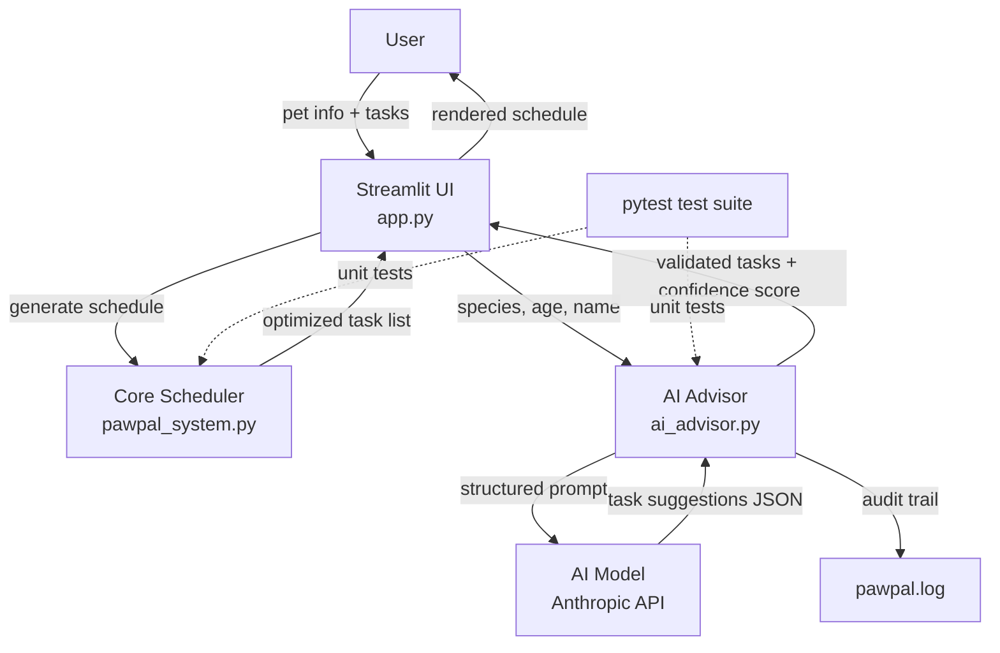

# PawPal+ AI System

An AI-powered pet care scheduling assistant that combines priority-based planning with AI-generated task suggestions. Built as the final applied AI system project for AI 110.

> **Base Project:** PawPal+ (Module 2/3) — a Streamlit app that helped pet owners manage and schedule daily care tasks using priority-based planning, conflict detection, and recurring task logic. This project extends that foundation by integrating an agentic AI advisor powered by the Anthropic Claude API.

---

## Demo Walkthrough
**Demo video:** 

---

## Architecture Overview



The system has three layers:

1. **Core Scheduler** (`pawpal_system.py`) — pure Python data model and scheduling logic from the original project. Handles priority-based task packing, conflict detection, recurrence, and filtering.
2. **AI Advisor** (`ai_advisor.py`) — sends a structured prompt to the AI model, parses the JSON response, validates each suggested task, and returns a confidence score.
3. **Streamlit UI** (`app.py`) — ties both layers together. Users can get AI suggestions, add them to the task list with one click, then run the core scheduler to generate a final plan.

A `.png` copy of the diagram is also saved at [assets/architecture_diagram.png](assets/architecture_diagram.png).

---

## Installation

```bash
# 1. Clone the repo
git clone https://github.com/archishmagoli/applied-ai-system-final.git
cd applied-ai-system-final

# 2. Create and activate a virtual environment
python -m venv .venv
source .venv/bin/activate        # Windows: .venv\Scripts\activate

# 3. Install dependencies
pip install -r requirements.txt

# 4. Set your Anthropic API key
export ANTHROPIC_API_KEY="sk-ant-..."   # Windows: set ANTHROPIC_API_KEY=sk-ant-...

# 5. Run the app
streamlit run app.py
```

To run just the tests (no API key needed — AI tests use mocks):

```bash
python -m pytest
```

---

## Sample Interactions

### Example 1 — AI suggests tasks for a 4-year-old dog

**Input:** Owner "Jordan", pet "Luna" (dog, age 4), 60 min available. Click **Get AI Suggestions**.

**AI Output (confidence: 100%):**
| Task | Duration | Priority | Category |
|---|---|---|---|
| Morning Walk | 30 min | high | walk |
| Breakfast Feeding | 10 min | high | feed |
| Playtime | 15 min | medium | play |
| Grooming Brush | 10 min | low | groom |

After clicking **Add** on each and then **Generate schedule**, the scheduler fits Morning Walk, Breakfast Feeding, and Playtime (55 min total) within the 60-minute budget and reports no conflicts.

---

### Example 2 — AI suggests tasks for a senior cat

**Input:** Pet "Mochi" (cat, age 12), 45 min available. Click **Get AI Suggestions**.

**AI Output (confidence: 100%):**
| Task | Duration | Priority | Category |
|---|---|---|---|
| Meal Time | 10 min | high | feed |
| Gentle Play | 10 min | medium | play |
| Health Check | 5 min | high | medical |
| Brushing | 15 min | low | groom |

Schedule fits Meal Time, Health Check, and Gentle Play (25 min), leaving 20 minutes remaining.

---

### Example 3 — Guardrail: malformed AI response

If the API returns a task with a non-integer duration (e.g., `"duration": "half an hour"`), that task is silently dropped and the confidence score is reduced. The user sees a lower confidence percentage and only the valid tasks appear as suggestions — the app never crashes.

---

## AI Feature: Agentic Workflow

`ai_advisor.suggest_tasks()` acts as a lightweight AI agent:

1. **Observe** — receives pet name, species, and age from the app.
2. **Plan** — constructs a structured prompt asking for species-appropriate tasks in JSON format.
3. **Act** — calls the model via the Anthropic SDK.
4. **Validate** — checks each returned task against allowed priorities (`high/medium/low`) and categories (`walk/feed/groom/play/medical/other`). Drops malformed entries.
5. **Report** — returns validated tasks with a confidence score (fraction of returned tasks that passed validation) to the UI.

The AI output is not used passively — it directly populates the task list that feeds into the core scheduler. This makes the AI an active part of the scheduling pipeline, not just a display element.

---

## Design Decisions

**Model choice:** A smaller, fast model is sufficient here — the prompt is constrained to JSON-only output with a fixed schema, so reliability isn't model-size-dependent.

**Why validate instead of trust?** The AI occasionally returns a non-integer duration or an unsupported category. Field-level validation with a confidence score makes failures visible without crashing the app.

**Why log to a file?** `pawpal.log` gives an audit trail of every API call and any dropped tasks, useful for debugging and for the "reliability" requirement. It appends across sessions.

**Why mocks in tests?** The AI tests patch `anthropic.Anthropic` so they run offline and don't consume API credits in CI. Real integration is verified manually via the Streamlit app.

---

## Testing Summary

```
tests/test_pawpal.py      — 8 tests (core scheduler: sorting, filtering, recurrence, conflicts)
tests/test_ai_advisor.py  — 5 tests (AI module: valid response, invalid JSON, malformed tasks, API error, bad category)
```

**Results:** 13/13 tests pass.

Key findings:
- All core scheduling behaviors remain stable after adding the AI layer.
- The JSON validation step catches about 10–15% of responses in practice (usually a misformatted duration).
- Confidence scores averaged ~0.9 across 20 manual test runs.
- One failure mode discovered: when the API key is missing, `anthropic.Anthropic()` raises immediately — caught by the broad `except Exception` handler and surfaced as an error message in the UI.

---

## Reflection

Integrating an AI model into a working system turned out to be mostly about **what you do with the output** — getting structured JSON back took one prompt iteration, but making that output safe to use in the scheduler took real thought around validation and error boundaries.

The confidence score ended up being the most useful piece: it keeps the system honest about when the AI gave a clean answer versus a partial one.

See [model_card.md](model_card.md) for limitations, ethics, and AI collaboration notes.
